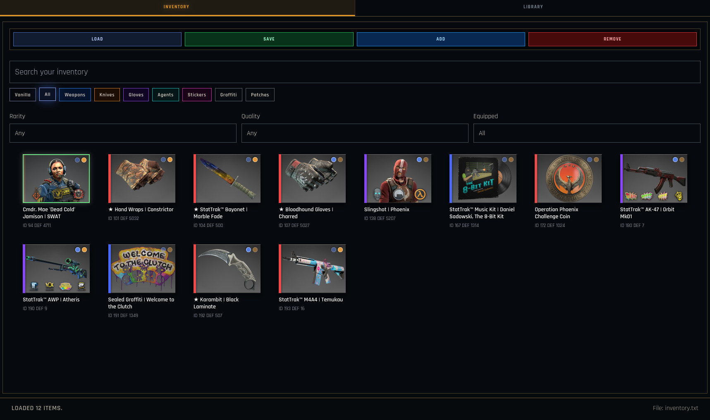
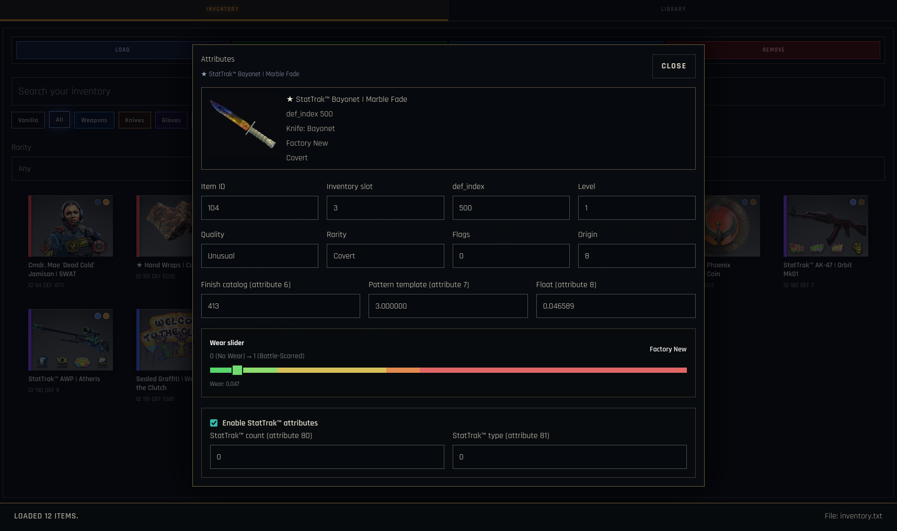
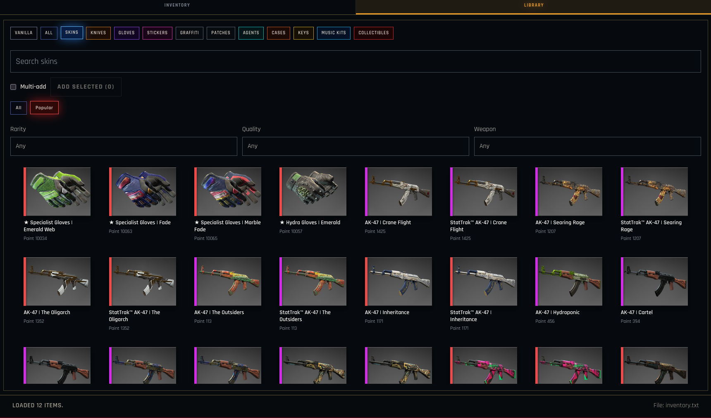
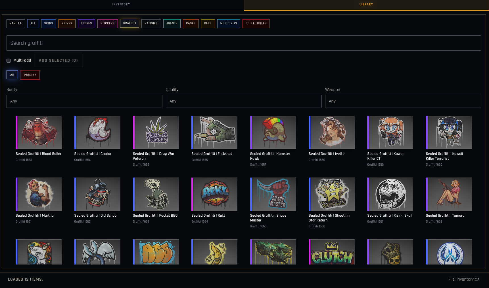
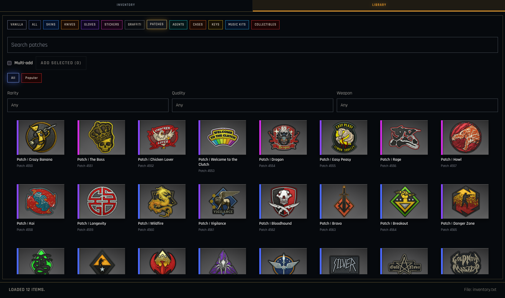
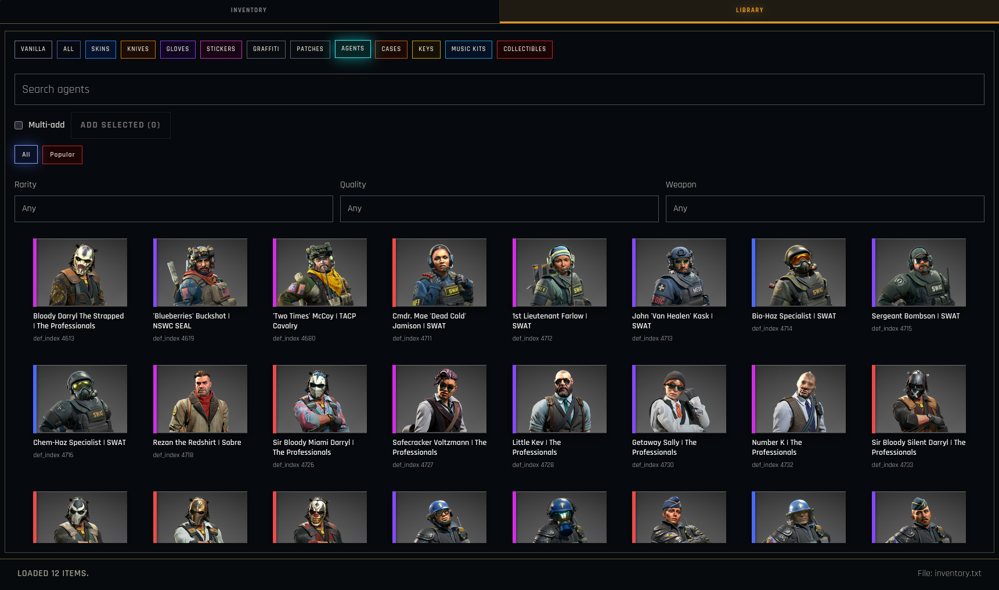
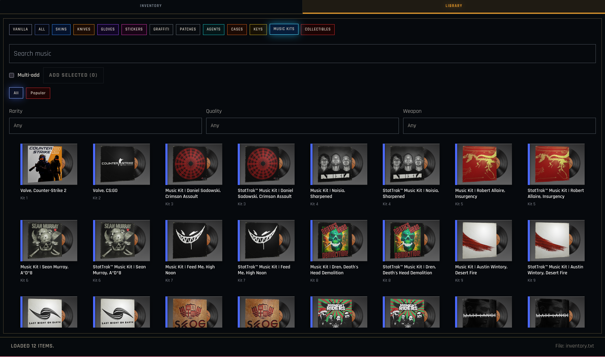
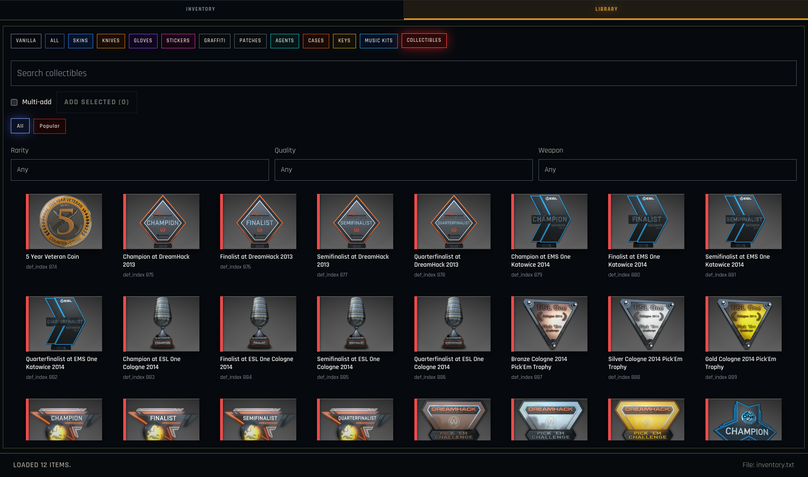
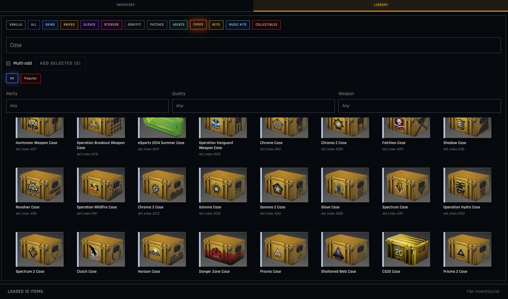
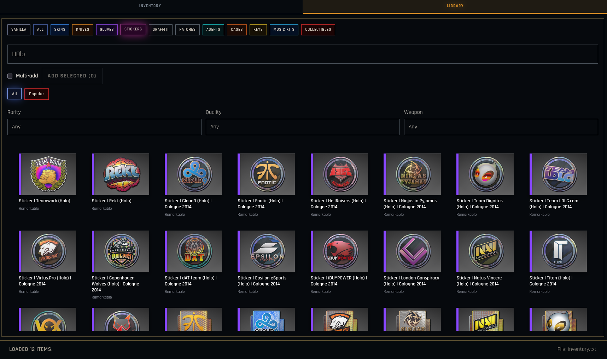

# csgo_gc_inventory-editor

A modern, visual editor for CS:GO inventory files used by [Mikko's `csgo_gc`](https://github.com/mikkokko/csgo_gc).

Build and manage complex CS:GO inventories without hand-editing KeyValues files. Browse thousands of items from a built-in API-backed library, apply stickers and patches, fine-tune attributes with an intuitive UI, and export everything back to `inventory.txt`.

## ✨ Key Features

| Inventory Management | Library Browser | Advanced Editing |
|---|---|---|
| Load and save `inventory.txt` files | Browse 10,000+ items (skins, agents, stickers, patches, graffiti, and more) | Full attribute control (paint, wear, quality, rarity) |
| Live search and category filters | Multi-select to add items in bulk | Wear slider with visual feedback |
| Filter by rarity, quality, equipped state | Apply stickers to weapons (up to 4 slots) | StatTrak™ & Souvenir toggles |
| Visual preview with item images | Apply patches to agents (up to 4 slots) | Pattern & finish editor |
| Preserve container structure | Real-time item count display | Attribute modal with metadata display |

## 📸 Screenshots

| | | |
|---|---|---|
|  **Inventory View** — Browse and filter loaded items |  **Attribute Editor** — Fine-tune item details with gear icons and wear slider |  **Skins Library** — Browse weapon skins with rarity filters |
|  **Graffiti Library** — Sealed graffiti patterns for weapon sprays |  **Patches Library** — Agent cosmetics with multi-slot preview |  **Agents Library** — Full character roster with equipped state tracking |
|  **Music Kits** — Sound packs with rarity tiers |  **Collectibles** — Tournament medals & souvenir drops |  **Cases & Keys** — Weapon cases and collection containers |
|  **Sticker Library** — 2000+ sticker designs with rarity colors | | |

## 🚀 Getting Started

### Prerequisites

- **Node.js** 18+ ([download](https://nodejs.org/))
- **npm** (included with Node.js)

### Quick Start

```bash
# Clone this repository
git clone https://github.com/nyctravex/csgo_gc_inventory-editor.git
cd csgo_gc_inventory-editor

# Install dependencies
npm install

# Start development server
npm run dev
```

Then open `http://localhost:5173` in your browser.

### Build for Production

```bash
npm run build       # Create optimized bundle
npm run preview     # Test production build locally
```

## 📖 Usage Guide

### Inventory Workflow

1. **Load a file**: Click `LOAD` and select your `inventory.txt` file from your csgo_gc directory
2. **Browse items**: Use the search bar and filter chips (Weapons, Knives, Gloves, etc.) to find items
3. **Inspect item**: Click any item card to view full details, rarity accents, applied stickers/patches, and wear information
4. **Edit attributes**: Use the attribute modal to adjust quality, rarity, paint index, pattern, wear, StatTrak, or any custom attributes
5. **Remove items**: Select items and click the `REMOVE` button (bottom-right of inventory panel)
6. **Save**: Click `SAVE` to export changes back to `inventory.txt`

### Library Workflow

1. **Browse categories**: Click category tabs (Skins, Agents, Graffiti, Patches, Music Kits, etc.)
2. **Search & filter**: Use the search bar and filter dropdowns (Rarity, Quality, Weapon type)
3. **Multi-select items**: Check items and click `ADD SELECTED` to add multiple items at once
4. **Add single item**: Uncheck multi-select and click any item card to add it directly
5. **View in inventory**: Newly added items appear in the Inventory tab ready for editing

### Special Item Types

**Weapon Skins**
- Paint index (finish), wear, and pattern template customization
- StatTrak™ and Souvenir toggles
- Up to 4 sticker slots with visual overlays
- Real wear slider with factory condition gradients

**Agents**
- Full character roster with team affiliation (CT/T)
- Up to 4 patch slots with visual preview overlays
- Rarity and quality control

**Stickers & Patches**
- Apply stickers to weapon skins (attribute 113, 117, 121, 125)
- Apply patches to agents (same attribute IDs)
- Browse 2000+ sticker designs from Holo, Foil, and Skulls collections
- Support for capsule and souvenir variants

**Graffiti & Collectibles**
- Sealed graffiti containers with spray patterns
- Tint and charge management (attributes 233, 232)
- Tournament medals and souvenir drops

## 🏗 Project Architecture

```
src/
├── renderer/
│   ├── App.tsx                 # Main application (3700+ lines)
│   ├── styles.css              # Global theme and component styles
│   ├── main.tsx                # DOM mount point
│   ├── types.ts                # TypeScript type definitions
│   ├── data/
│   │   ├── urls.ts             # API endpoints for item data
│   │   ├── options.ts          # Filter and display options
│   │   ├── def_indexes.ts      # Item definition constants
│   │   └── agents.json         # Local agent metadata
│   └── lib/
│       ├── inventory.ts        # KeyValues parsing/serialization
│       └── kv.ts               # Low-level KV format parser
├── index.html                  # Entry point
├── vite.config.ts              # Vite bundler configuration
├── tailwind.config.cjs         # Tailwind CSS theme
└── tsconfig.json               # TypeScript compiler options
```

## 🔧 Technology Stack

- **React 18** — UI framework
- **TypeScript** — Type-safe development
- **Vite** — Lightning-fast build tool
- **Tailwind CSS** — Utility-first styling
- **ByMykel CSGO-API** — Item data source (2000+ items via REST API)

## 📚 Data & Attributions

- **Item preview images** — Provided by [ByMykel/CSGO-API](https://github.com/ByMykel/CSGO-API)
- **Item metadata** — Sourced from Community Sticker Capsules, Tournament Drops, and Case Collections
- **KeyValues format** — Compatible with Valve's Source Engine configuration format
- **API endpoints** — Real-time item database with rarity, quality, and market metadata

### Data Sources

| Item Type | API Endpoint | Count |
|---|---|---|
| Skins | `/public/api/en/skins.json` | 2000+ |
| Stickers | `/public/api/en/stickers.json` | 1500+ |
| Agents | `/public/api/en/agents.json` | 60+ |
| Graffiti | `/public/api/en/graffiti.json` | 400+ |
| Patches | `/public/api/en/patches.json` | 60+ |
| Music Kits | `/public/api/en/music_kits.json` | 100+ |
| Collectibles | `/public/api/en/collectibles.json` | 500+ |
| Cases & Keys | `/public/api/en/cases.json` | 200+ |

## 📄 License

This project is licensed under the **CPULL License** — personal and non-commercial use only.

⚠️ **Important**: Read the full license terms in [LICENSE.md](LICENSE.md) before using this software.

- ✅ Personal, non-commercial inventory management
- ✅ Educational and research purposes
- ❌ Commercial use, resale, or redistribution
- ❌ Use in commercial inventory services or trading tools

## 🤝 Contributing

Contributions are welcome! Whether you're fixing bugs, adding features, or improving documentation:

1. **Fork** the repository
2. Create a **feature branch** (`git checkout -b feature/awesome-feature`)
3. Keep commits focused and descriptive
4. **Test** your changes thoroughly
5. Open a **pull request** with a clear description
6. Contributors are credited in the app

### Development Tips

- Hot module reloading works with `npm run dev`
- TypeScript errors show in the terminal and IDE
- Test inventory files are in the repo (`.txt` format)
- API calls are cached in memory per session

## 💬 Support & Feedback

- **Found a bug?** Open an issue with steps to reproduce
- **Feature request?** Describe the use case and expected behavior
- **General questions?** Check existing issues first
- **csgo_gc integration?** See [Mikko's repository](https://github.com/mikkokko/csgo_gc) for related tools

## ⭐ Show Your Support

If this project has been useful to you, please consider:

- **Starring** ⭐ the repository to show support
- **Sharing** with the CS:GO community
- **Contributing** improvements or bug fixes
- **Reporting** issues to help improve the tool

---

**Built with ❤️ for the CS:GO community**

[Report Issue](https://github.com/nyctravex/csgo_gc_inventory-editor/issues) • [Feature Request](https://github.com/nyctravex/csgo_gc_inventory-editor/issues) • [csgo_gc](https://github.com/mikkokko/csgo_gc)
