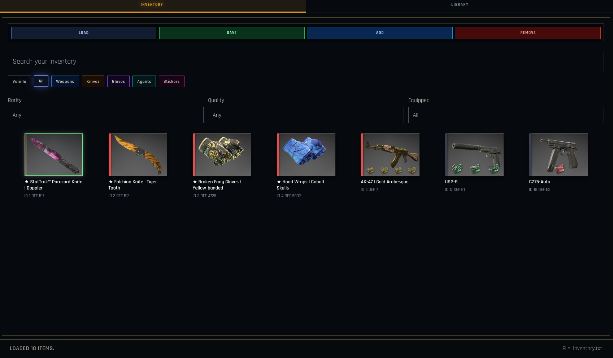
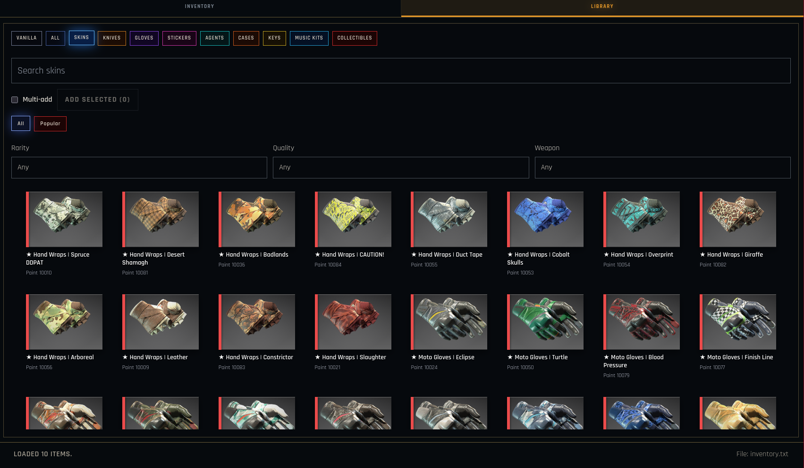
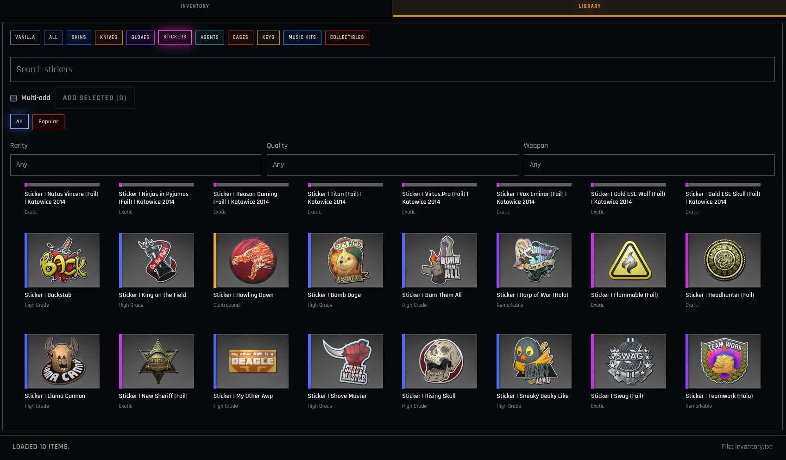
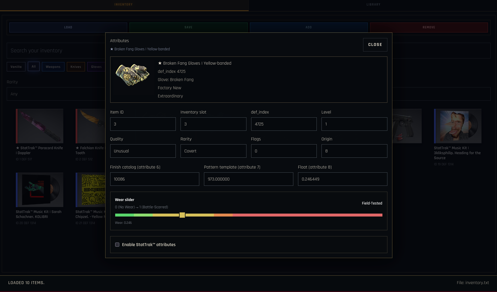

# csgo_gc_inventory-editor

`csgo_gc_inventory-editor` is a graphical editor for the `inventory.txt` file used by [Mikko's `csgo_gc`](https://github.com/mikkokko/csgo_gc).

It provides a fast, visual workflow for loading, browsing, editing, and saving inventories without hand-editing KeyValues files.

## Overview

The app is built around two primary workflows:

1. `Inventory`: inspect existing items, filter them, edit attributes, and save changes back to `inventory.txt`.
2. `Library`: browse a built-in item database and add skins, knives, gloves, stickers, agents, cases, keys, music kits, and collectibles to your inventory.

## Features

- Load and save `inventory.txt` files.
- Preserve inventory container structure when parsing and serializing documents.
- Browse inventory items with live search and category filters.
- Filter inventory by rarity, quality, and equipped state.
- Browse a built-in library of vanilla items, skins, gloves, stickers, agents, cases, keys, music kits, and collectibles.
- Use library multi-select to add several items in one pass.
- Edit item attributes such as `def_index`, quality, rarity, paint index, pattern template, wear, and StatTrak fields.
- Preview item images, applied stickers, rarity accents, and equipped CT/T state.
- Use a wear slider for skin items with readable wear labels.
- Receive footer feedback for add/save/load flows.

## Screenshots

### Inventory tab



### Library tab



### Sticker library view



### Attribute editor modal



## Getting Started

### Requirements

- Node.js 18 or newer
- npm

### Installation

```bash
npm install
```

### Development

```bash
npm run dev
```

### Production build

```bash
npm run build
```

### Preview the production build

```bash
npm run preview
```

## Usage

1. Start the app.
2. Open the `Inventory` tab and use `Load` to import an existing `inventory.txt`, or begin with a fresh document.
3. Select an item to inspect and edit its fields.
4. Open the `Library` tab to browse available items and add them to the inventory.
5. Use category chips, search, and dropdown filters to narrow down results.
6. Save the result back to `inventory.txt` with `Save`.

## Project Structure

```text
src/
	img/                 Local screenshots used in the README
	renderer/
		App.tsx            Main application UI and workflows
		styles.css         Global styling and theme
		data/              Item datasets and option lists
		lib/               Inventory parsing and serialization helpers
```

## Data and Credits

- CS item preview data and icon references are based on the CS item datasets bundled with the project.
- CS2 icon previews are provided by [ByMykel/CSGO-API](https://github.com/ByMykel/CSGO-API/).

## License

This project is licensed under the CPULL License.

Important restriction: personal and non-commercial use only. See [LICENSE.md](LICENSE.md) for the full terms.

## Contributing

Contributions are welcome.

1. Fork the repository.
2. Create a branch for your change.
3. Keep changes focused and clearly described.
4. Open a pull request for review.
5. Contributors are credited in the app.

## Support

If the project is useful to you, consider starring the repository.
